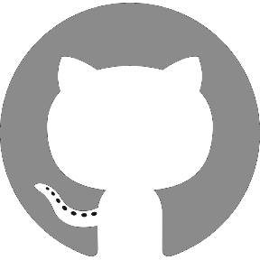

### Hey there, My name is Senna - aka [Senna Development][website] 👋

---

## 📋 About me

### I'm a Webpage-, Application-, Game Developer and Modder.
- 💻 I'm currently working on a website for [Senna Development][website].

### Connect with me:
[][website]
[][twitter]
[][discord]

 

### Languages and Tools:

 
 

---

## 📚 Statistics

  <table><tr>
    <td width="50%">
        
    </td>
    <td width="42%" style="vertical-align: top;">
        
    </td>
    </tr>
    </table>

[website]: https://sennadevelopment.github.io/
[twitter]: https://twitter.com/Senna_Dev/
[discord]: https://discord.com/invite/sennadevelopment

---

## 👀 Visitors

